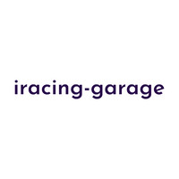

<p align="center"></p>
<p align="center"></p>

`iracing-garage` makes extracting iRacing data simple

> [!NOTE]
> This package is not officially launched on pypi yet

## Installation

```bash
pip install iracing-garage
```

Usage (H2):

Provide concrete examples on how to utilize your wrapper with code snippets.
Explain the basic functionalities and demonstrate how to interact with the iRacing API through your wrapper.
Consider including different usage scenarios to showcase flexibility.
Contributing (H2) (Optional):

## Wiki

Do you need some help? Check out the articles on the [wiki](wwww.google.com).

## Contributing

Got something interesting you'd like to share? Learn about [contributing](wwww.google.com).

Specify the open-source license under which your project is distributed (e.g., MIT License).
Include a link to the license file (LICENSE.md) for reference.
Author(s) (H2) (Optional):

Briefly introduce yourself/your team as the project creators.
Include links to your profiles (optional) for further information.
Additional Sections (Optional):

Consider adding sections like "Features" for a high-level overview of functionalities, or "Known Issues" for transparency.
Style and Readability:

Markdown Formatting: Utilize headings, bullet points, and code blocks for clear organization.
Concise Language: Use clear and concise language, avoiding technical jargon where possible.
Active Voice: Emphasize action and clarity using active voice for instructions.
Friendliness: Maintain a welcoming and approachable tone to encourage potential contributors.
