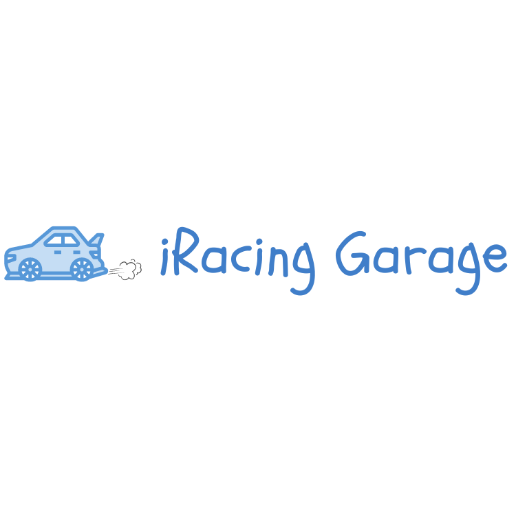

<p></p>

> [!NOTE]
> This package is not officially launched on pypi yet

iracing-garage
============

# Home

##  Welcome to **iracing\_garage**! 🏎️

This is a simple and free Python wrapper around the [iRacing API](https://forums.iracing.com/discussion/15068/general-availability-of-data-api/p1), 
created for the awesome iRacing community. Whether you're building a tool, 
analyzing your races, or just love data — this is your pit crew in code form. 😎

---

## 🚀 Getting Started

The official documentation can be found [here](https://dangkv.github.io/iracing_garage/).

### 1. Install the package 📦

Clone the repo:

```bash
git clone https://github.com/dangkv/iracing_garage.git
cd iracing_garage
```

Install dependencies:

```bash
pip install -r requirements.txt
```

(Optional: consider creating a virtual environment)

---

### 2. Authentication 🛡️

You'll need to log in with your iRacing email and password (this uses the same method the iRacing web portal does).

```python
from iracing_garage import iRacingGarage

email = 'maxv@gmail.com'
password = 'hotwheels'

iracing = iRacingGarage(email, password)
```

> 🔒 *This iRacing Garage does not store your credentials. It's all handled securely at runtime.*

---

## 🔍 What Can You Do?


After logging in, you can access a bunch of data in JSON format from the iRacing API.
Here are some examples:

### Get Cars 🚗

```python hl_lines="1"
cars = iracing.car.get()
print(cars)
```

### Get Tracks 🏁

```python hl_lines="1"
tracks = iracing.track.get()
print(tracks)
```

### Get Driver Stats 📊

```python hl_lines="2"
cust_id = 123456
driver_data = iracing.stats.summary(cust_id)
print(driver_data)
```

### Get Race Results 🏆

```python hl_lines="3"
subsession_id = 654321
simsession_number = 0
results = iracing.results.get(subsession_id, simsession_number)
print(results)
```

### Check out the [Data Endpoints](https://dangkv.github.io/iracing_garage/data-endpoints/) page for more data points!!

---

## 📬 Contact

* Maintainer: [dangkv](https://github.com/dangkv) + [hmkamel](https://github.com/hmkamel)

---

## 🏁 Final Lap

Enjoy the ride. 🏎️💨


## License
You can check out the full license [here](LICENSE)

This project is licensed under the terms of the **MIT** license.
